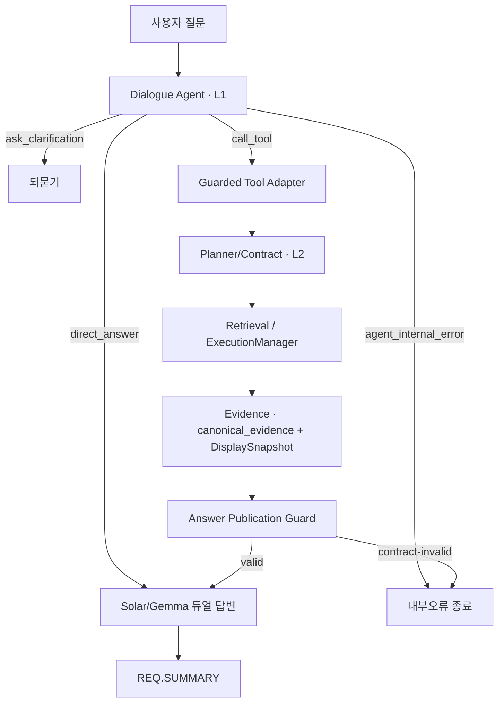

# 01. 아키텍처

> 이 문서는 [00 온보딩](./00_ONBOARDING.md)의 "5단계 흐름"을 **"누가 무엇을 책임지나"** 관점으로 한 단계 더 들어간다. 앞부분(§1~§3)은 개념, 뒤(§4~)는 정밀 참조다.

## 1. 가장 중요한 한 가지: "의도는 위에서, 실행은 아래에서"

이 시스템의 모든 설계는 한 문장으로 요약된다:

> **맨 앞 LLM이 "사용자가 무엇을 원하는지"를 정하면, 그 아래 단계들은 그걸 *바꾸지 않고* 기술적으로 실행만 한다.**

이걸 두 층으로 부른다.

- **L1 (의도) =** "신동구 연구자의 활동을 *목록으로* 보여줘" 같은 **사용자의 뜻**. 맨 앞 LLM(Dialogue Agent)이 정한다.
- **L2 (실행) =** 그 뜻을 이루기 위한 **검색 조건·필터·개수** 같은 기술 디테일. 아래 단계(Planner 등)가 만든다.

**왜 굳이 나누나?** LLM은 똑똑하지만 가끔 흔들린다("10개"라고 했다가 갑자기 "20개"를 만든다든지). 이때 *사용자가 원한 핵심(누구를, 무엇을)*까지 흔들리면 엉뚱한 답이 나간다. 그래서 **핵심(L1)은 잠가두고, 사소한 디테일(L2)만 아래에서 손본다.**

### Shock Absorber — "사소한 것만 고쳐주는 완충장치"

`Shock Absorber`(완충기)는 위 원칙을 실제로 강제하는 장치다. 이름 그대로, LLM의 잔진동을 흡수한다.

- **고쳐주는 것 (Smart Coercion):** 표시 개수 같은 부수 파라미터만. 예) "상세히 보여줘"인데 개수가 5로 왔으면 → **1개로 바로잡음**(상세는 원래 한 대상이니까).
- **절대 안 고치는 것:** 누구를 찾는지(대상), `pjt_id`/`pjt_no` 같은 식별자 축, 검색 방식(SEARCH/LOOKUP/JOIN). 여기서 충돌이 나면 **고치지 않고 멈춘다** — 되묻거나 내부오류로 닫는다. (틀린 걸 몰래 고쳐서 그럴듯한 오답을 내느니, 차라리 안 한다.)

근거 결정 기록: [ADR-0016](./ADR/ADR-0016_Agent_Contract_Shock_Absorber.md).

## 2. 플래너인가, 에이전트인가? — 세 개의 뇌

자주 헷갈리는 질문이다. 답: **둘 중 하나가 아니라 "에이전트가 위에, 플래너가 아래에" 있는 하이브리드**다. 한 요청은 세 개의 뇌를 순서대로 지난다.

| 순서 | 누구 | 성격 | 결정하는 것 |
|---|---|---|---|
| 1 | `rule_precheck` | 결정적 규칙 | LLM 없이 끝낼 수 있는 건 바로 처리 |
| 2 | `run_dialogue_agent` | **LLM 에이전트** | 이번 턴에 뭘 할까(직접답변/도구호출/되묻기/에러) |
| 3 | `execute_agent_tool` → Planner → `ExecutionManager` | 결정적 컴파일러+파이프라인 | 그 의도를 검색조건·쿼리·복구로 변환·실행 |

- **2번이 "에이전트"** — LLM이 전략적 결정을 내리는 곳은 여기 *한 군데*뿐이다. 도구 실행 후 흐름은 앞(검색→답변)으로 갈 뿐 에이전트로 되돌아오지 않는다(되돌아오는 유일한 경로 = 도구 에러 시 1회 재시도). 즉 ReAct식 자율 루프가 아니라 **턴당 1회 판단하는 프런트 컨트롤러**다. `AGENTIC_MAX_STEPS`는 예약만 돼 있고 미적용.
- **3번이 "플래너"** — 단, 이 코드의 `Planner`는 *여러 단계를 계획하는* 고전적 플래너가 아니라 **의도 → Qdrant 쿼리플랜으로 번역하는 컴파일러**이며, 그래프 노드가 아니라 `execute_agent_tool` 안에서 돈다. 검색 복구 루프(`rag_search ↔ relax_and_retry`)에도 LLM은 없다(규칙 기반).
- 그 아래 LLM(Solar/Gemma)은 결정을 내리는 게 아니라 **답을 생성·검증하는 일꾼**이다.

**한 문장:** 계약으로 묶인 파이프라인 위에 *한 번만 판단하는* LLM 프런트 컨트롤러를 얹은 것 — **에이전트로 제어하고, 플래너로 실행한다.** 이게 §1의 L1/L2 경계이며, 결정적 파이프라인 → 에이전트형으로 옮기는 **과도기 설계**다(ADR-0001 "In Progress").

> **디버깅 지침:** *결정*이 틀리면(엉뚱한 도구·불필요한 되묻기) → 에이전트(`run_dialogue_agent`, `AGENT.DECISION` 로그). 결정은 맞는데 *실행*이 틀리면(필터·개수·`pjt_id`/`pjt_no` 혼용) → 플래너/파이프라인(`PLANNER.*`, `RAG.EXECUTION_MANAGER.RESULT` 로그).

## 3. 계층 — 누가 무엇을 책임지나

00의 5단계를 코드 계층으로 풀면 이렇다. (왼쪽이 위, 즉 의도에 가깝다.)

| 계층 | 쉬운 말로 | 산출물 | 핵심 코드 |
|---|---|---|---|
| **Dialogue Agent** | "무슨 의도지?" 판단 (L1) | `AgentDecision` | `apps/conversation/agent_dialogue_router.py` |
| **Tool Backend Guard** | 의도를 도구 입력으로 안전 변환 | `IntentPayloadV3` | `apps/conversation/agent_tool_executor.py` |
| **Planner / Contract** | 검색 조건으로 컴파일 (L2) | `IntentContract`, `QdrantQueryPlan` | `apps/planner/planner_runtime.py` |
| **Orchestrator / Retrieval** | 실제 검색 + 실패 시 복구 | `ExecutionTrace`, `ToolResult` | `apps/retrieval/execution_manager.py` |
| **Evidence / Display** | 원본을 답변용 근거로 정리 | `canonical_evidence`, `DisplaySnapshot` | `apps/evidence/canonical_evidence.py` |
| **Answer Publication Guard** | 답이 근거와 맞나 최종 점검 후 발행 | `FinalAnswer` | `apps/chat/answer_generation.py` |

**경계 규칙(위반하면 버그):** 각 계층은 자기 윗 계층이 정한 걸 못 바꾼다.
- Agent는 DB 필터·식별자를 직접 만들지 않는다(의미 수준의 말만 한다).
- 검색 계층은 "상세 요청"을 마음대로 "넓은 검색"으로 바꾸지 않는다.
- 도구(tool)는 전체 대화 상태를 들여다보지 않는다(필요한 입력만 받는다 — 상태 격리).
- 답변 계층은 점검에 실패한 컨텍스트를 LLM에 슬쩍 넣지 않는다.

## 4. 검색 방식 3종 (SEARCH / LOOKUP / JOIN)

질문 성격에 따라 검색 방법이 다르다. 이 셋은 아래 단계가 함부로 못 바꾼다.

| 방식 | 언제 | 비유 |
|---|---|---|
| **SEARCH** | "AI 관련 과제 찾아줘"처럼 폭넓게 | 도서관에서 주제로 책 더미 찾기 (recall 우선) |
| **LOOKUP** | "과제번호 X의 상세"처럼 콕 집어 | 청구기호로 책 한 권 꺼내기 (정확도 우선) |
| **JOIN** | "이 과제의 성과 전부"처럼 연결해서 | 책에 딸린 부록·논문 묶어오기 (관계) |

## 5. 패키지 지도 (정밀 참조)

| 패키지 | 책임 |
|---|---|
| `apps/api` | FastAPI 라우트, 런타임 배선, 워크플로 빌드(`workflow_builder.py`/`workflow_nodes.py`), 스트리밍, 도메인 매퍼 |
| `apps/conversation` | Dialogue Agent, 세션/대화 메모리, follow-up·anchor·scope 해석, state card |
| `apps/planner` | 질의 분석 → 실행 전략 컴파일(단계별 플래너, Qdrant 컴파일러, intent adapter) |
| `apps/retrieval` | RAG 실행(dense/sparse/JOIN), `ExecutionManager` 복구 정책, 검색 그래프 노드 |
| `apps/evidence` | canonical evidence, context/prompt packing, citation, detail contract, render profile |
| `apps/chat` | Solar/Gemma 답변 생성·merge, LLM 런타임, 스트리밍, groundedness 가드 |
| `apps/platform` | 설정/스키마/스토리지/메트릭/추론 클라이언트(공통 인프라) |
| `apps/prompts` | 런타임 로드되는 마크다운 프롬프트 자산 |

## 6. 요청 실행 흐름 (정밀 참조)

1. **Request Ingress** — API 라우트가 워크플로 시드 + SessionMemory 뷰 생성
2. **Dialogue Agent Decision** — `direct_answer`/`call_tool`/`ask_clarification`/`agent_internal_error`
3. **Guarded Tool Adapter** — `IntentPayloadV3`/`QuestionAnalysisV3` 생성, 파서 비호환 토큰·count 계약·도구 스키마 검증
4. **Planner/Contract Assembly** — Stage 2 슬롯을 `QdrantQueryPlan`으로 재컴파일, 필터 환각 제거, detail count → `1/1`
5. **Retrieval Execution** — `SEARCH/LOOKUP/JOIN` 보존. 단일 `pjt_id` detail은 lookup 정책, 단일후보 없으면 broad `SEARCH_RECOVERY` 금지
6. **Evidence/Display Snapshot** — raw → `canonical_evidence` + render_profile + display snapshot
7. **Answer Publication Guard** — groundedness·answer-state 정합성 검증. contract-invalid → LLM 스트림 대신 결정적 종료 메시지
8. **Response/Ops Summary** — `REQ.SUMMARY` 기록

> 데이터 함정과 규칙 → [02 계약과 도메인 규칙](./02_CONTRACTS_AND_RULES.md) · 검색 실패 시 복구 → [03 행동 안전](./03_BEHAVIORAL_SAFETY.md)
