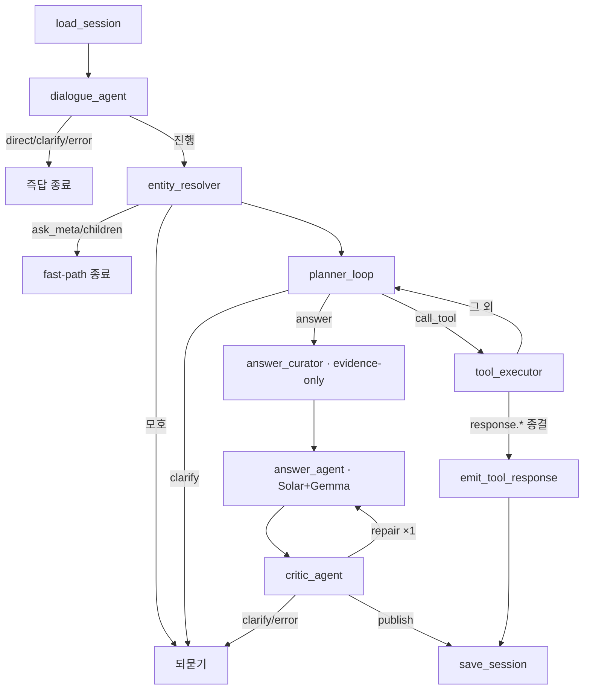

# 01. 아키텍처

> [00 온보딩](./00_ONBOARDING.md)의 흐름을 "누가 무엇을 책임지나"로 한 단계 더 들어간다. §1~§2가 개념, §3~가 정밀 참조다.

## 1. 큰 그림: agent-first + 도구 backplane

이 시스템의 정체성은 한 문장이다:

> **챗봇(에이전트)이 대화를 주도하고, NTIS 벡터 검색은 에이전트가 *필요할 때 부르는 도구* 일 뿐이다.**

NTIS 벡터 DB가 제품의 경계가 아니다. MCP 서버처럼 "근거가 필요할 때 호출하는 backplane"이다. 그래서 에이전트는 인사·능력설명엔 검색을 안 쓰고, 범위 밖 질문은 정직하게 거절하고, 모호하면 되묻고, NTIS 근거가 필요할 때만 검색한다. (ADR-0019)

## 2. 3계층 권한분리 (ADR-0018) — 가장 중요한 구조 원칙

세 가지 권한을 **서로 다른 컴포넌트가** 갖고, **서로 침범하지 않는다.** 버그의 상당수가 "한 계층이 남의 일을 할 때" 생긴다.

| 계층 | 권한 | 누가 | 하는 일 |
|---|---|---|---|
| **L1 판단(Interaction)** | "무엇을 할지" | `DialogueAgent`, `PlannerAgent`, LangGraph 라우팅 | 의도 분류, NTIS 필요 여부, 직접답변/되묻기/거절/도구호출 결정. **Planner가 유일한 충분성(adequacy) 판정자**(ADR-0023). |
| **L2 근거(Evidence)** | "데이터를 가져오기" | `ToolExecutor`, `apps/pipeline/tools/*`, `SearchAgent`, `apps/pipeline/retrieval/*` | 도구 실행, `CanonicalEvidence`로 정규화, `Observation`/`SearchResult` 반환. **사용자 의도를 재해석하지 않는다.** |
| **L3 발행(Publication)** | "사용자에게 내보내기" | `AnswerAgent`, `CriticAgent`, grounding checker, terminal emit 노드, API serializer | 답 생성, groundedness 검증, 출처 발행. |

## 3. 단일 agentic 파이프라인 (ADR-0020)

예전엔 그래프가 둘(정적 + agentic)이었으나, ADR-0020이 **정적 그래프를 삭제하고 하나로 통일**했다(`RAG_AGENTIC_MODE` 토글도 제거). 지금은 파이프라인이 하나뿐이다.

핵심은 **`planner_loop ⇄ tool_executor` 되먹임**이다. 플래너(LLM)가 도구를 부르고, 결과를 보고 다시 판단하고, "이제 답하자"를 스스로 결정한다. 상세는 [03 에이전트 런타임](./03_AGENTIC_RUNTIME.md).

## 4. 런타임 구성 (정밀 참조)

`apps/api/runtime.py`가 공유 자원을 조립한다:

- Qdrant 클라이언트·임베딩 모델 (`apps.retrieval.rag_store` — 옛 패키지를 빌딩블록으로 재사용).
- **`solar_vllm_0`**: dialogue/planner/critic 판단 + **메인 답변**(패널 A).
- **`gemma_triton_0`**: **비교 답변**(패널 B) + `response.*` 직접답변 도구.
- `SearchAgent`(NTIS 벡터 DB 실행기), `ToolExecutor` + 기본 도구 레지스트리, LangGraph 컴파일 그래프.

> 참고: 이 브랜치는 `apps/pipeline`(라이브)와 옛 패키지(`apps/{retrieval,chat,evidence,planner,conversation}`)가 **공존**한다. 옛 패키지는 죽은 코드가 아니라 pipeline이 재사용하는 하위 빌딩블록이다(예: `apps.retrieval.rag_store`, `apps.chat.llm_runtime`).

## 5. 세션 모델 (정밀 참조)

`SessionState`는 개념적으로 세 슬롯을 갖는다:

- `current_subject` — 사람/기관 앵커.
- `published_manifest` — 직전 턴에 사용자에게 보인 목록.
- `focused_detail` — 가장 최근 상세 엔티티(이어묻기용 캐시 근거 포함).

지속화 어댑터는 여전히 `SessionMemory.current_context`를 통해 KV에 쓴다 → **인메모리 상태가 KV 저장 포맷보다 풍부하다**(세 슬롯이 KV에선 하나로 압축됨). 정확한 제약은 [02 계약과 규칙](./02_CONTRACTS_AND_RULES.md) §세션 계약. KV 키: `pipeline:v1:{conversation_id}:session`.
