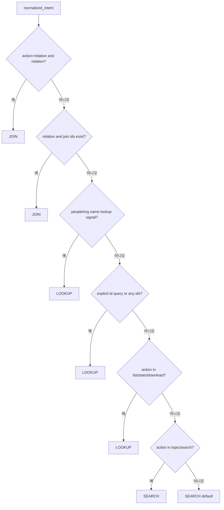

# SEARCH / LOOKUP / JOIN 결정 가이드

이 문서는 NTIS Domain RAG가 사용자 질의를 `SEARCH`, `LOOKUP`, `JOIN` 중 어떤 mode로 해석하는지 설명하는 가이드입니다.
신규 참여자가 소스코드 없이도 mode 선택 규칙을 이해할 수 있도록 작성합니다.

## 문서 역할

- 이 문서는 모드(mode) 결정 규칙의 설명 문서입니다.
- 코드 기준 source of truth는 `apps/core/schemas.py::select_mode_policy()`와 `build_query_plan()`입니다.
- strict contract와 fail-close 규칙은 [CONTRACT.md](/D:/Project/python_project/ntis_domain_rag_chatbot/docs/CONTRACT.md)를 우선합니다.
- 파라미터 정의는 [PLANNER_PARAMETER_REFERENCE.md](/D:/Project/python_project/ntis_domain_rag_chatbot/docs/PLANNER_PARAMETER_REFERENCE.md)를 우선합니다.

## 한 줄 요약

- `SEARCH`: 넓게 찾는 탐색형 질의
- `LOOKUP`: 식별자나 강한 제약이 있는 정확 조회 질의
- `JOIN`: 관계형 2-hop retrieval이 필요한 질의

## 전체 결정 순서

모드(mode) 결정은 대략 아래 순서를 따릅니다.

1. relation action / relation id seed 확인
2. people/org name 기반 lookup 신호 확인
3. explicit id query 확인
4. action 기반 기본 mode 결정
5. relation과 target collections를 반영해 query plan 완성

### 결정 흐름 다이어그램

## SEARCH 정의

### 언제 SEARCH로 가는가

- broad topic query
- 탐색형 질의
- explicit id가 없고 name-based strong lookup signal도 없으며, action이 `topic` 또는 `search` 계열일 때
- 최종 fallback default

### 대표 예시

- `AI related projects`
- `배터리 관련 과제`
- `최근 반도체 연구 동향`

### 핵심 특징

- recall과 ranking signal이 우선입니다.
- 과도한 hard filter를 두면 안 됩니다.
- broad discovery를 위한 모드(mode)입니다.

### 자주 헷갈리는 경우

- 기관명이나 사람 이름이 들어가면 SEARCH보다 LOOKUP 신호가 더 강해질 수 있습니다.
- 성과유형, 연도, title term이 있다고 바로 LOOKUP이 되는 것은 아니지만, 다른 강한 제약과 결합되면 LOOKUP 쪽으로 기울 수 있습니다.

## LOOKUP 정의

### 언제 LOOKUP으로 가는가

- explicit identifier가 있을 때
- `is_id_query=true`
- `ids_map`에 강한 id seed가 있을 때
- 사람/기관 이름 기반 조회 신호(lookup signal)가 있을 때
- action이 `list`, `detail`, `stats`, `download`일 때 기본적으로 LOOKUP 계열

### 대표 예시

- `1711015550 project detail`
- `ETRI papers stats 2021 2023`
- `Kim researcher projects`
- `참여기관이 KAIST인 과제 목록`

### 핵심 특징

- 정확 필터(filter)와 강한 제약 기반 조회가 중심입니다.
- 사람/기관 질의도 기본적으로 LOOKUP으로 시작합니다.
- planner와 runtime은 이름 기반 signal을 retrieval 의미로 보존해야 합니다.

### 사람/기관 이름 조회 신호(people/org name lookup signal)

아래 값이 있으면 LOOKUP 신호가 강해집니다.

- `people_terms`
- `lead_org_terms`
- `participant_org_terms`
- `people_affiliation_org_terms`
- `org_terms`
- `org_role`가 `lead | performer | performing | participant | affiliation`

### 자주 헷갈리는 경우

- LOOKUP은 id query만 의미하지 않습니다.
- 사람명/기관명처럼 이름 기반으로 대상을 좁히는 질의도 LOOKUP입니다.
- broad topic query에 기관명이 잠깐 섞인 경우는 SEARCH와 LOOKUP 사이에서 intent normalization 품질을 같이 봐야 합니다.

## JOIN 정의

### 언제 JOIN으로 가는가

- relation query이고 relation seed가 명확할 때
- relation과 함께 join id seed가 있을 때
- relation action이 있고 planner가 relation query를 canonicalize 했을 때

### 대표 예시

- `PJT-2020-1234-5678 related outputs`
- `이 과제의 성과`
- `이 논문의 관련 과제`

### 핵심 특징

- 관계형 2-hop retrieval 모드(mode)입니다.
- relation intent와 유효한 join seed가 모두 필요합니다.
- planner contract, runtime prelude, execution policy, runtime key materialization, hop2 compile selection이 모두 맞아야 실행됩니다.

### relation과 join seed

- relation만 있고 join seed가 없으면 strict 기본 경로에서는 JOIN 실행이 성립하지 않습니다.
- `join_key_mode=instance`는 `pjt_id`
- `join_key_mode=group`는 `pjt_no`
- `group + pjt_no 없음`은 planner contract 위반입니다.

## 코드 기준 결정 표(decision table)

이 표는 `select_mode_policy()` 기준입니다.

| 조건 | 결과 mode | 이유 문자열 |
|---|---|---|
| `action == relation` and `relation 있음` | `join` | `relation_action` |
| `relation == (people, project)` and `people_terms 있음` | `lookup` | `people_project_lookup` |
| `relation 있음` and relation join ids 존재 | `join` | `relation_ids` |
| people/org name lookup signal 있음 | `lookup` | `people_org_name_lookup` |
| `is_id_query=true` or any ids or `id_exact/id_fuzzy` | `lookup` | `id_or_exact` |
| `action in (list, stats, download)` | `lookup` | `list_like` |
| `action in (topic, search)` | `search` | `topic_search` |
| 그 외 | `search` | `default` |

## 대상 컬렉션(target collections) 결정

mode 결정 이후 query plan은 대상 컬렉션(target collections)을 정합니다.

### relation query

- relation이 있으면 relation target collections를 우선합니다.
- 예:
  - `project -> perf`
  - `perf -> project`

### base route query

- relation이 없으면 `base_route` 기준 default collection을 사용합니다.
- 대표값:
  - `project -> ntis_project_v1`
  - `perf -> ntis_perf_v1`
  - `people/org -> ntis_project_v1 + ntis_perf_v1`

설명:

- `people/org` 정보는 `project`와 `perf` 양쪽에 존재합니다.
- 따라서 `people/org` 기본 탐색도 `project + perf`를 함께 봅니다.

### 성과 집중 신호(perf focus signal)

- 성과 중심 signal은 retrieval emphasis와 후속 policy 판단에는 영향을 줄 수 있습니다.
- 대표 signal:
  - `perf_types`
  - `keywords`, `title`, `retrieval_query` 내 `논문`, `특허`, `성과`

## 자주 보는 오해

### `action=list`면 항상 SEARCH인가

- 아닙니다.
- 현재 기본 규칙에서는 `list`는 LOOKUP 계열입니다.

### 기관명/사람명이 있으면 항상 JOIN인가

- 아닙니다.
- 사람/기관 이름 기반 질의는 기본적으로 LOOKUP 쪽입니다.
- JOIN은 relation과 join seed가 함께 있을 때만 허용됩니다.

### relation query면 무조건 JOIN인가

- relation intent만으로는 부족합니다.
- strict 기본 경로에서는 relation + join seed가 함께 성립해야 합니다.

### broad query인데 title/perf term이 있으면 LOOKUP인가

- 아닙니다.
- perf focus signal은 retrieval emphasis에는 영향을 줄 수 있지만, mode 자체는 다른 strong signal과 함께 봐야 합니다.

## 신규 참여자 읽는 순서

1. 이 문서로 mode 결정 규칙을 파악합니다.
2. [PLANNER_PARAMETER_REFERENCE.md](/D:/Project/python_project/ntis_domain_rag_chatbot/docs/PLANNER_PARAMETER_REFERENCE.md)에서 각 파라미터의 정의를 확인합니다.
3. [SYSTEM_FLOW_RETRIEVAL_FIRST.md](/D:/Project/python_project/ntis_domain_rag_chatbot/docs/SYSTEM_FLOW_RETRIEVAL_FIRST.md)로 단계별 artifact handoff를 확인합니다.
4. [CONTRACT.md](/D:/Project/python_project/ntis_domain_rag_chatbot/docs/CONTRACT.md)에서 fail-close 규칙을 확인합니다.
